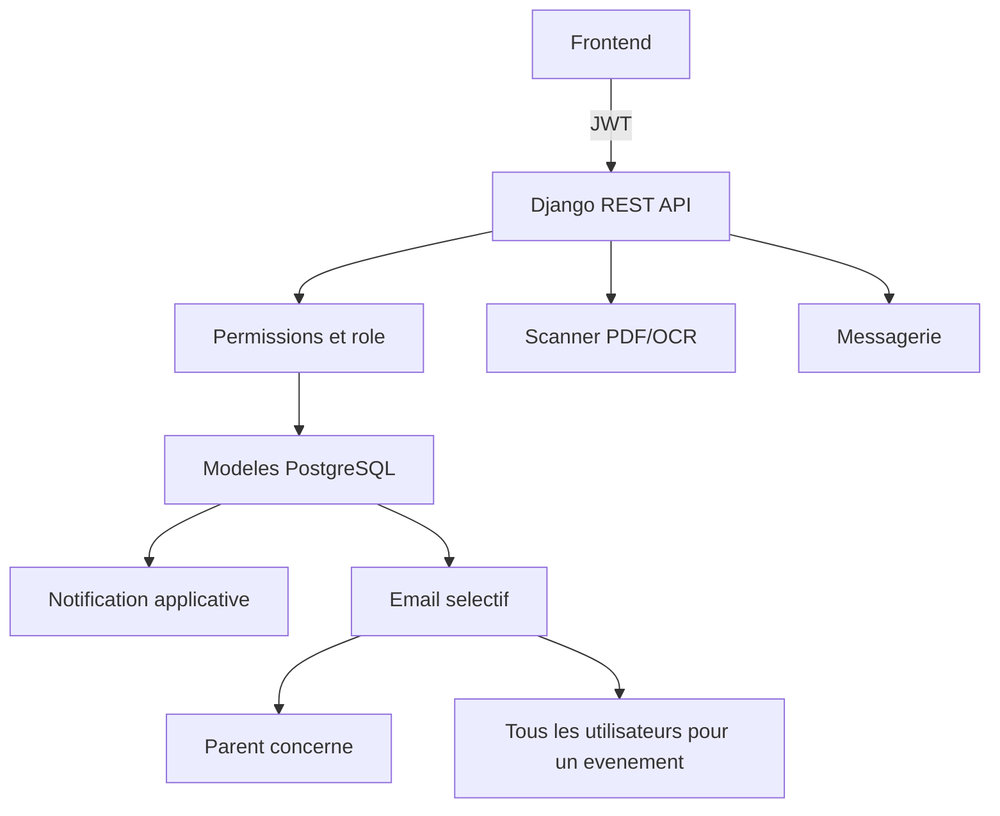

# Alfarouk - API Django de gestion scolaire

API REST du projet Alfarouk. Elle permet de gérer les utilisateurs, les parents, les eleves, les enseignants, les classes, les emplois du temps, les absences, les retards, les devoirs, les bulletins, la messagerie et les notifications.

Le backend est construit avec Django, Django REST Framework, JWT et PostgreSQL.

## 1. Fonctionnalites

- Authentification par JWT.
- Trois roles applicatifs : `PARENT`, `ENSEIGNANT` et `ADMIN`.
- Gestion des enfants rattaches a un parent.
- Affectation des enseignants aux classes et aux matieres.
- Consultation des eleves selon le role connecte.
- Saisie des absences et des retards par les enseignants.
- Import et lecture de devoirs/bulletins PDF.
- Import d'emplois du temps PDF.
- Messagerie texte, audio et URL media.
- Evenements crees par l'administration.
- Notifications dans l'application.
- Notifications temps reel par WebSocket pour les messages et les evenements.
- Analyse statistique des resultats par eleve, matiere et trimestre.
- Analyse explicable des performances avec recommandations indicatives hors ligne.
- Emails automatiques pour les absences, retards, devoirs et evenements.
- Interface d'administration Django.

## 2. Architecture

```text
Django/
|-- manage.py                     Commandes Django
|-- requirements.txt              Dependances Python
|-- .env.example                  Exemple de configuration
|-- Taslim/
|   |-- settings.py               Configuration Django, DB, JWT, CORS, email
|   |-- urls.py                   Routes HTTP de l'API
|   |-- asgi.py                   Point d'entree ASGI
|   `-- wsgi.py                   Point d'entree WSGI
|-- membres/
|   |-- models.py                 Modele de donnees et signal d'evenement
|   |-- views.py                  Endpoints REST et logique applicative
|   |-- consumers.py              Consumer WebSocket des notifications
|   |-- jwt_middleware.py         Authentification JWT des WebSockets
|   |-- routing.py                Routes WebSocket Channels
|   |-- statistical_analysis.py   Calcul des statistiques de resultats
|   |-- performance_ai.py         Analyse explicable des performances
|   |-- admin.py                  Configuration de l'interface admin
|   |-- permissions.py             Permissions par role reutilisables
|   |-- bulletin_scanner.py        Extraction PDF/OCR des bulletins
|   |-- timetable_scanner.py       Extraction PDF/OCR des emplois du temps
|   |-- tests.py                   Tests Django et API
|   |-- migrations/                Historique du schema SQL
|   `-- management/commands/      Commandes Django personnalisees
|-- media/messages/audio/          Fichiers audio envoyes par la messagerie
`-- venv/                          Environnement Python local, non a versionner
```

## 3. Prerequis

- Windows, Linux ou macOS.
- Python 3.11 ou une version compatible avec les dependances.
- PostgreSQL demarre et accessible.
- Git recommande.
- Pour l'OCR : Tesseract installe sur la machine et disponible dans le `PATH`.

Le scanner utilise `pypdf` pour les PDF contenant du texte. Pour les PDF images, il utilise PyMuPDF et Tesseract.

## 4. Installation Windows

Depuis PowerShell, a la racine du projet :

```powershell
py -3.11 -m venv venv
.\venv\Scripts\Activate.ps1
python -m pip install --upgrade pip
pip install -r requirements.txt
```

Si PowerShell bloque l'activation :

```powershell
Set-ExecutionPolicy -Scope Process -ExecutionPolicy RemoteSigned
.\venv\Scripts\Activate.ps1
```

Le projet contient deja un dossier `venv`. Dans ce cas, il suffit généralement de l'activer et d'installer les dependances manquantes.

## 5. Configuration `.env`

Copier le fichier exemple :

```powershell
Copy-Item .env.example .env
```

Puis adapter les valeurs :

```env
SECRET_KEY=une-cle-secrete-longue-et-aleatoire
DEBUG=True

DB_NAME=postgres
DB_USER=postgres
DB_PASSWORD=mot_de_passe_postgres
DB_HOST=localhost
DB_PORT=5432

CORS_ALLOWED_ORIGINS=http://localhost:5173,http://127.0.0.1:5173

EMAIL_HOST=smtp.gmail.com
EMAIL_PORT=587
EMAIL_USE_TLS=True
EMAIL_HOST_USER=adresse@gmail.com
EMAIL_HOST_PASSWORD=mot_de_passe_application_gmail
DEFAULT_FROM_EMAIL=adresse@gmail.com

ADMIN_USERNAME=admin
ADMIN_EMAIL=admin@example.com
ADMIN_PASSWORD=mot_de_passe_admin
```

Ne jamais versionner `.env`. Pour Gmail, utiliser un mot de passe d'application et non le mot de passe principal du compte.

### Attention a la configuration CORS

La configuration actuelle contient les origines de developpement dans `settings.py`. Pour ajouter une origine, modifier `CORS_ALLOWED_ORIGINS` ou faire evoluer la lecture de la variable `.env`.

## 6. Base de donnees et migrations

Verifier la configuration Django :

```powershell
.\venv\Scripts\python.exe manage.py check
```

Appliquer les migrations :

```powershell
.\venv\Scripts\python.exe manage.py migrate
```

Apres une modification d'un modele :

```powershell
.\venv\Scripts\python.exe manage.py makemigrations membres
.\venv\Scripts\python.exe manage.py migrate
```

La migration `0010_evenement_notification` cree les tables des evenements et notifications.

Voir l'etat des migrations :

```powershell
.\venv\Scripts\python.exe manage.py showmigrations membres
```

## 7. Creer un administrateur

Methode Django standard :

```powershell
.\venv\Scripts\python.exe manage.py createsuperuser
```

Methode fournie par le projet :

```powershell
.\venv\Scripts\python.exe create_admin.py
```

Le script lit `ADMIN_USERNAME`, `ADMIN_EMAIL` et `ADMIN_PASSWORD` depuis `.env`.

## 8. Lancer le serveur

```powershell
.\venv\Scripts\python.exe manage.py runserver
```

Adresses utiles :

- API : `http://127.0.0.1:8000/`
- Verification : `http://127.0.0.1:8000/api/health/`
- Administration : `http://127.0.0.1:8000/admin/`

Reponse de verification :

```json
{
  "status": "ok",
  "message": "API Django ready"
}
```

## 9. Authentification JWT

### Connexion

```http
POST /api/auth/login/
Content-Type: application/json
```

```json
{
  "username": "mon_utilisateur",
  "password": "mon_mot_de_passe"
}
```

La reponse contient `tokens.access` et `tokens.refresh`.

Pour les routes protegees, envoyer :

```http
Authorization: Bearer <access_token>
```

### Rafraichir un token

```http
POST /api/token/refresh/
Content-Type: application/json
```

```json
{
  "refresh": "<refresh_token>"
}
```

### Profil courant

```http
GET /api/auth/me/
Authorization: Bearer <access_token>
```

## 10. Roles et regles metier

### Parent

- Consulte ses enfants.
- Consulte les absences, retards, devoirs, notes, bulletins et emplois du temps de ses enfants.
- Contacte les enseignants de ses classes et l'administration.
- Recoit les notifications d'absence, de retard et de devoir.
- Recoit les evenements de l'administration.

### Enseignant

- Consulte les eleves de ses classes.
- Saisit les absences et retards.
- Importe les devoirs et bulletins.
- Contacte les parents de ses classes et l'administration.
- Recoit les evenements de l'administration.
- Recoit les notifications de nouveaux messages.

### Administrateur

- Gere les utilisateurs depuis `/admin/`.
- Gere les classes, eleves, emplois du temps et evenements.
- Peut consulter les donnees globales.
- Recoit les evenements et les nouveaux messages.

## 11. Routes API

Toutes les routes ci-dessous, sauf indication contraire, demandent un token JWT.

### Sante et utilisateurs

| Methode | Route | Role | Description |
|---|---|---|---|
| GET | `/api/health/` | Public | Verifie que l'API fonctionne |
| POST | `/api/auth/register/` | Public | Cree un parent ou un enseignant |
| POST | `/api/auth/login/` | Public | Connexion et obtention des tokens |
| POST | `/api/auth/forgot-password/` | Public | Envoie un mot de passe temporaire |
| GET | `/api/auth/me/` | Connecte | Retourne l'utilisateur courant |
| POST | `/api/auth/profile/` | Connecte | Modifie le profil |
| GET | `/api/admin/utilisateurs/` | Admin | Retourne les utilisateurs et eleves |
| GET | `/api/parents/eleves/` | Parent/Admin | Retourne les parents avec leurs enfants |

### Classes et emplois du temps

| Methode | Route | Description |
|---|---|---|
| GET | `/api/classes/` | Liste les eleves, filtrable par classe |
| GET/POST | `/api/classes/scanner/` | Recherche une classe depuis une valeur scannee |
| GET | `/api/classes/options/` | Retourne les niveaux et matieres disponibles |
| GET | `/api/enseignant/classes/` | Classes de l'enseignant connecte |
| GET | `/api/enseignant/eleves/` | Eleves des classes de l'enseignant |
| GET | `/api/emplois-du-temps/` | Emplois du temps visibles par l'utilisateur |
| GET | `/api/parent/emplois-du-temps/` | Emplois du temps des enfants du parent |
| POST | `/api/emplois-du-temps/scanner/` | Importe un ou plusieurs PDF |
| GET | `/api/classes/<classe>/emploi-du-temps/` | Emploi du temps d'une classe |

### Absences et retards

| Methode | Route | Description |
|---|---|---|
| GET | `/api/absences/` | Historique visible |
| POST | `/api/absences/` | Saisie d'une liste par un enseignant |
| GET | `/api/retards/` | Historique visible |
| POST | `/api/retards/` | Saisie d'une liste par un enseignant |

Exemple :

```json
{
  "absences": [
    {
      "eleve_id": 12,
      "date": "2026-09-09",
      "motif": "Maladie"
    }
  ]
}
```

A la creation, le parent recoit une notification dans l'application et un email si son adresse est renseignee.

### Devoirs et bulletins

| Methode | Route | Description |
|---|---|---|
| GET | `/api/devoirs/` | Historique des devoirs visibles |
| POST | `/api/devoirs/scanner/` | Importe et analyse des devoirs PDF |
| GET | `/api/parent/notes/` | Notes des enfants groupees par trimestre |
| GET | `/api/parent/bulletins/` | Bulletins du parent |
| GET | `/api/parent/statistiques/` | Statistiques des resultats visibles |
| GET | `/api/parent/analyse-ia/` | Analyse indicative des performances |
| POST | `/api/bulletins/scanner/` | Analyse un bulletin sans l'enregistrer |
| GET | `/api/documents/devoirs/` | Alias de l'historique des devoirs |

Les fichiers sont envoyes en `multipart/form-data`. Le champ accepte notamment `devoirs`, `devoir`, `fichier` ou `file`.

Les routes d'analyse acceptent `trimestre=1|2|3` et `eleve_id` en parametres
facultatifs. Elles appliquent les memes regles de visibilite que les notes.
Les statistiques retournent moyenne, mediane, ecart-type, minimum, maximum et
taux de reussite. L'analyse IA est deterministe, fonctionne sans service
externe et reste indicative.

Un devoir nouvellement enregistre genere une notification et un email pour le parent de l'eleve. Une mise a jour du meme devoir ne genere pas de doublon de notification.

### Evenements

| Methode | Route | Role | Description |
|---|---|---|---|
| GET | `/api/evenements/` | Connecte | Liste les evenements |
| POST | `/api/evenements/` | Admin | Cree un evenement et notifie tous les utilisateurs actifs |

Exemple :

```json
{
  "date": "2026-10-01",
  "titre": "Reunion de rentree",
  "contenu": "La reunion commence a 09:00 dans la salle principale."
}
```

La creation depuis l'API ou depuis Django Admin declenche le meme signal. Chaque utilisateur actif ayant un email recoit un email.

### Notifications

| Methode | Route | Description |
|---|---|---|
| GET | `/api/notifications/` | Liste les notifications et les compteurs |
| POST | `/api/notifications/<id>/click/` | Marque une notification comme lue |

Filtrer par type :

```text
GET /api/notifications/?type=MESSAGE
GET /api/notifications/?type=ABSENCE
GET /api/notifications/?type=RETARD
GET /api/notifications/?type=DEVOIR
GET /api/notifications/?type=EVENEMENT
```

La reponse contient :

- `notifications` : toutes les notifications du filtre courant.
- `school_notifications` : absences, retards, devoirs et evenements.
- `message_notifications` : nouveaux messages.
- `unread_count` ou `count` : total non lu.
- `school_count` : total scolaire non lu.
- `message_count` : total message non lu.

Chaque notification expose notamment `type`, `category`, `eleve`, `nom_eleve`, `prenom_eleve`, `date`, `heure`, `auteur`, `is_clicked` et `data`.

### Messagerie

| Methode | Route | Description |
|---|---|---|
| GET | `/api/messages/contacts/` | Contacts autorises |
| GET | `/api/messages/<interlocuteur_id>/` | Conversation complete |
| GET | `/api/messages/` | Messages de l'utilisateur |
| POST | `/api/messages/` | Envoie un message texte ou audio |

Exemple texte :

```json
{
  "destinataire_id": 8,
  "contenu": "Bonjour, voici une information."
}
```

Un message cree une notification applicative chez le destinataire, mais aucun email.

## 12. Exemple Axios

```ts
const response = await axios.get<NotificationsResponse>(
  `${URL}/api/notifications/`,
  {
    headers: {
      Authorization: `Bearer ${accessToken}`,
    },
  }
);

const {
  school_notifications,
  message_notifications,
  school_count,
  message_count,
} = response.data;
```

Marquer une notification comme lue :

```ts
await axios.post(
  `${URL}/api/notifications/${notification.id}/click/`,
  {},
  {
    headers: {
      Authorization: `Bearer ${accessToken}`,
    },
  }
);
```

## 13. Emails automatiques

Les emails sont envoyes par les points suivants :

- Absence : parent de l'eleve.
- Retard : parent de l'eleve.
- Devoir : parent de l'eleve.
- Evenement : tous les utilisateurs actifs avec une adresse email.
- Message : aucun email.

Le backend utilise `send_mail` et `fail_silently=True`. Ainsi, une indisponibilite temporaire du serveur SMTP ne fait pas echouer l'enregistrement en base. En production, un service asynchrone comme Celery est recommande pour ne pas ralentir la requete HTTP.

## 14. Scanners PDF et OCR

### Bulletin

`bulletin_scanner.py` :

1. Verifie que le fichier est un PDF.
2. Limite la taille a 10 Mo.
3. Extrait le texte avec `pypdf`.
4. Si le PDF est image, tente PyMuPDF + Tesseract.
5. Extrait le nom, prenom, classe, matieres, notes et composition.

### Emploi du temps

`timetable_scanner.py` :

1. Extrait le texte ou lance l'OCR indirectement.
2. Detecte la classe, le jour, les horaires, la matiere et la salle.
3. Retourne les creneaux normalises.
4. L'endpoint cree ou met a jour les entrees correspondantes.

Si aucun texte n'est detecte, installer Tesseract et verifier que la commande `tesseract` est accessible :

```powershell
tesseract --version
```

## 15. Administration Django

Ouvrir `http://127.0.0.1:8000/admin/` avec un compte superutilisateur.

Les modeles administrables sont :

- Utilisateurs.
- Eleves.
- Classes.
- Emplois du temps.
- Absences.
- Retards.
- Devoirs.
- Messages.
- Evenements.
- Notifications.

Un evenement peut etre cree dans l'admin avec sa date, son titre et son contenu. Le signal Django cree automatiquement les notifications et envoie les emails.

## 16. Tests

Executer tous les tests :

```powershell
.\venv\Scripts\python.exe manage.py test
```

Executer une classe de tests :

```powershell
.\venv\Scripts\python.exe manage.py test membres.tests.MessagingEndpointTests
```

Le projet teste notamment :

- Authentification et profils.
- Permissions par role.
- Filtrage des eleves et emplois du temps.
- Absences et retards.
- Import des devoirs et bulletins.
- Messagerie et fichiers audio.
- Notifications, compteurs et clics.
- Envoi d'emails avec le backend email de test.

## 17. Commande de nettoyage des donnees demo

La commande supprime uniquement les comptes dont le username commence par `parent_demo_` ou `enseignant_demo_`, ainsi que leurs eleves et classes associes :

```powershell
.\venv\Scripts\python.exe manage.py purge_demo_data
```

Elle utilise une transaction et ne supprime pas les utilisateurs reels.

## 18. Depannage

### `ModuleNotFoundError`

Activer le bon environnement virtuel et installer les dependances :

```powershell
.\venv\Scripts\Activate.ps1
python -m pip install -r requirements.txt
```

### Erreur `corsheaders`

Le serveur a probablement ete lance avec le Python global au lieu de celui du projet :

```powershell
.\venv\Scripts\python.exe manage.py runserver
```

### Erreur de table inexistante

Verifier puis appliquer les migrations :

```powershell
.\venv\Scripts\python.exe manage.py showmigrations
.\venv\Scripts\python.exe manage.py migrate
```

### Erreur PostgreSQL

Verifier que PostgreSQL est demarre et que `DB_NAME`, `DB_USER`, `DB_PASSWORD`, `DB_HOST` et `DB_PORT` correspondent a la base locale.

### Erreur 401

- Verifier la presence de `Authorization: Bearer <access_token>`.
- Verifier que le token n'est pas expire.
- Utiliser `/api/token/refresh/` avec le refresh token.

### Erreur 403

Le compte est authentifie mais son role ne permet pas l'action demandee. Consulter la section Roles et regles metier.

### Emails non recus

- Verifier que `EMAIL_HOST_USER` et `EMAIL_HOST_PASSWORD` sont corrects.
- Utiliser un mot de passe d'application Gmail.
- Verifier l'adresse email de l'utilisateur en base.
- Tester la connexion SMTP et consulter les logs du serveur.

## 19. Recommandations avant production

- Mettre `DEBUG=False`.
- Remplacer `SECRET_KEY` par une valeur aleatoire et privee.
- Ne pas exposer les identifiants PostgreSQL ni SMTP.
- Restreindre `ALLOWED_HOSTS` et `CORS_ALLOWED_ORIGINS`.
- Utiliser HTTPS.
- Configurer un serveur WSGI ou ASGI de production.
- Utiliser un service email fiable.
- Deporter les emails et les OCR longs dans une file asynchrone.
- Ajouter une rotation et une surveillance des logs.
- Sauvegarder PostgreSQL et le dossier `media/`.

## 20. Flux principal



## 21. Style de maintenance

- Modifier les modeles uniquement avec une migration.
- Garder les controles d'acces dans les vues ou permissions DRF.
- Utiliser les helpers existants pour filtrer les eleves et les contacts.
- Ajouter un test pour chaque nouvelle route ou regle de role.
- Ne pas mettre de secrets dans le code source.
- Documenter les changements metier dans ce README.
